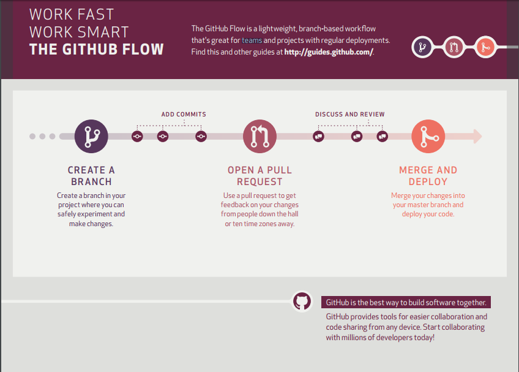

### Table of contents
1. [What is Github?](#what-is-github?)
2. [Lets Begin](#lets-begin)  
		1.  [Step 1. Create a Repository](#step-1-create-a-repository)  
		2.  [Step 2. Create a Branch](#step-2-create-a-branch)  
		3.  [Step 3. Make and commit changes](#step-3-make-and-commit-changes)  
		4.  [Step 4. Open a Pull Request](#step-4-open-a-pull-request)  
		5.  [Step 5. Merge your Pull Request](#step-5-merge-your-pull-request)  
3. [Forking Projects](#forking-projects)  

What is GitHub?
===================
GitHub is a code hosting platform for version control and collaboration. It lets you and others work together on projects from anywhere.

This tutorial teaches you GitHub essentials like repositories, branches, commits, and Pull Requests. You’ll create your own Hello World repository and learn GitHub’s Pull Request workflow, a popular way to create and review code.

----------

Lets Begin
===================

Step 1. Create a Repository
-------------

A repository is usually used to organize a single project. Repositories can contain folders and files, images, videos, spreadsheets, and data sets – anything your project needs. We recommend including a README, or a file with information about your project. GitHub makes it easy to add one at the same time you create your new repository. It also offers other common options such as a license file.

### To create a new repository :
> - In the upper right corner, next to your avatar, click  and then select New repository.
> - Name your repository say "hello-world".
> - Write a short description.
> - Select Initialize this repository with a README.
> - Click Create repository.

Step 2. Create a Branch
-------------

Branching is the way to work on different versions of a repository at one time.

By default your repository has one branch named `master` which is considered to be the definitive branch. We use branches to experiment and make edits before committing them to master.

When you create a branch off the master branch, you’re making a copy, or snapshot, of master as it was at that point in time. If someone else made changes to the master branch while you were working on your branch, you could pull in those updates.

This diagram shows:

> - The master branch
> - A new branch called feature (because we’re doing ‘feature work’ on this branch)
> - The journey that feature takes before it’s merged into master

### To create a new branch :
> - Go to your new repository hello-world.
> - Click the drop down at the top of the file list that says branch: master.
> - Type a branch name, readme-edits, into the new branch text box.
> - Select the blue Create branch box or hit “Enter” on your keyboard.

Now you have two branches, master and readme-edits. They look exactly the same, but not for long! Next we’ll add our changes to the new branch.

Step 3. Make and commit changes
-------------

Now, you’re on the code view for your readme-edits branch, which is a copy of master. Let’s make some edits.

On GitHub, saved changes are called commits. Each commit has an associated commit message, which is a description explaining why a particular change was made. Commit messages capture the history of your changes, so other contributors can understand what you’ve done and why.

### Make and commit changes :
> - Click the README.md file.
> - Click the  pencil icon in the upper right corner of the file view to edit.
> - In the editor, write a bit about yourself.
> - Write a commit message that describes your changes.
> - Click Commit changes button.

These changes will be made to just the README file on your readme-edits branch, so now this branch contains content that’s different from master.

Step 4. Open a Pull Request
-------------

Nice edits! Now that you have changes in a branch off of master, you can open a pull request.

Pull Requests are the heart of collaboration on GitHub. When you open a pull request, you’re proposing your changes and requesting that someone review and pull in your contribution and merge them into their branch. Pull requests show diffs, or differences, of the content from both branches. The changes, additions, and subtractions are shown in green and red.

As soon as you make a commit, you can open a pull request and start a discussion, even before the code is finished.

You can even open pull requests in your own repository and merge them yourself. It’s a great way to learn the GitHub Flow before working on larger projects.

### Open a Pull Request for changes to the README :

> - Click the  Pull Request tab, then from the Pull Request page, click the green New pull request button.

> - In the Example Comparisons box, select the branch you made, readme-edits, to compare with master (the original).

> - Look over your changes in the diffs on the Compare page, make sure they’re what you want to submit.

> - When you’re satisfied that these are the changes you want to submit, click the big green Create Pull Request button.

> - Give your pull request a title and write a brief description of your changes.

> - When you’re done with your message, click Create pull request!

Step 5. Merge your Pull Request
-------------

In this final step, it’s time to bring your changes together – merging your readme-edits branch into the master branch.

If you are contributing to projects owned by others , then this step will be done by them after reviewing your PR(pull request).

> - Click the green Merge pull request button to merge the changes into master.
> - Click Confirm merge.
> - Go ahead and delete the branch, since its changes have been incorporated, with the Delete branch button in the purple box.

Forking Projects
===================

After using GitHub by yourself for a while, you may find yourself wanting to contribute to someone else’s project. Or maybe you’d like to use someone’s project as the starting point for your own. This process is known as forking.

Creating a “fork” is producing a personal copy of someone else’s project. Forks act as a sort of bridge between the original repository and your personal copy. You can submit Pull Requests to help make other people’s projects better by offering your changes up to the original project. Forking is at the core of social coding at GitHub.

Fork the repository
-------------

To fork the repository, click the Fork button in the header of the repository.

Sit back and watch the forking magic. When it’s finished, you’ll be taken to your copy of the repository.

After Forking make the required changes and commit the changes.

Making Pull Request
-------------
At last, you’re ready to propose changes into the main project! This is the final step in producing a fork of someone else’s project, and arguably the most important. If you’ve made a change that you feel would benefit the community as a whole, you should definitely consider contributing back.

To do so, head on over to the repository on GitHub.com where your project lives. For this example, it would be at `https://www.github.com/your_username/RepoName` . You’ll see a banner indicating that you’ve recently pushed a new branch, and that you can submit this branch “upstream,” to the original repository:

Clicking on Compare and Pull Request sends you to a discussion page, where you can enter a title and optional description. It’s important to provide as much useful information and a rationale for why you’re making this Pull Request in the first place. The project owner needs to be able to determine whether your change is as useful to everyone as you think it is.

When you’re ready typing out your heartfelt argument, click on Send pull request. You’re done!

